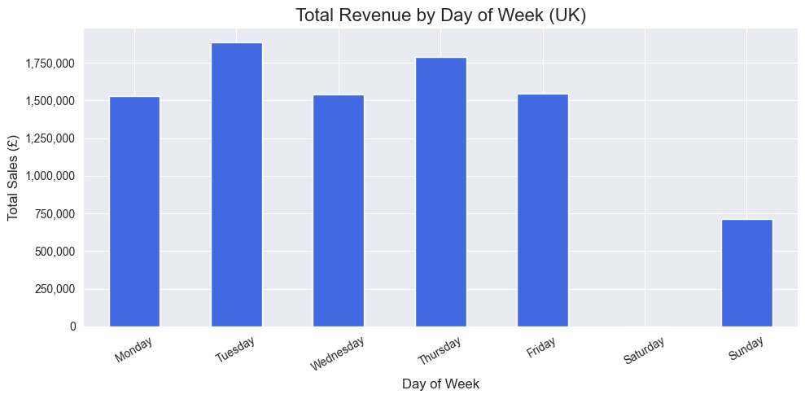

# Retail Analytics Project: Insights & Recommendations

I've analyzed the Online Retail dataset (UK transactions) to identify bestsellers and purchase patterns.

## 1. Key Business Insights

### Peak Shopping Times
- **Busiest Hour**: 12:00 PM (Noon) is the absolute peak for sales revenue (£1.2M+).
- **Shopping Window**: 70% of daily sales occur between **10:00 AM and 3:00 PM**.
- **Quiet Times**: Sales drop significantly after 5:00 PM.

### Comparison by Day
- **Busiest Day**: Tuesday (£1.88M)
- **Runner Up**: Thursday (£1.79M)
- *Note: Saturday shows no sales (likely closed).*

### Top Bestsellers (Revenue)
1. **DOTCOM POSTAGE** (£206k)
2. **PAPER CRAFT , LITTLE BIRDIE** (£168k)
3. **REGENCY CAKESTAND 3 TIER** (£142k)

## 2. Recommendation based on insights

> **Action**: Schedule promotional emails to arrive between **10:00 AM - 11:30 AM** on Tuesdays and Thursdays.
>
> **Why**: This ensures the message lands just before the peak shopping window of 12 PM, capturing customers when they are most active.

## 3.1 Visualization: Sales by Hour

## 3.2 Visualization: Sales by Day

## 4. Methodology
- **Data Source**: Dataset: Online Retail Data from Kaggle https://lnkd.in/digH8CnD 
- **Scope**: UK Customers only, Returns excluded.
- **Data Cleaning**: Removed null values, converted data types and handled outliers.
- **Tools**: Python (Pandas) for ETL/Analysis, Matplotlib/Seaborn for Visualization.
